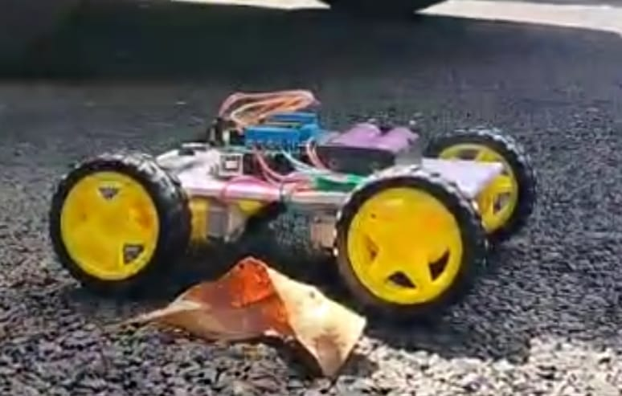

# Voice-Controlled-Car
An Arduino-based voice-controlled robotic car that enables hands-free navigation using Bluetooth. Voice commands from a smartphone are transmitted via an HC-05 module to the Arduino, which controls DC motors through a motor driver for real-time wireless movement and direction control.

## Features
- Voice-controlled navigation
- Bluetooth communication
- Wireless operation
- Real-time motor control

## Components
- Arduino Uno
- HC-05
- L293D Motor Shield
- 4 DC Motors
- Chassis
- Battery Pack

## Installation

1. Clone this repository.
2. Open the Arduino code in Arduino IDE.
3. Install the AFMotor library.
4. Upload the code to Arduino Uno.
5. Pair your smartphone with the HC-05 module.
6. Use a Bluetooth voice control app to send commands.

## Usage

- Connect the HC-05 module.
- Open the voice control app.
- Speak commands such as:
  - Forward
  - Backward
  - Left
  - Right
  - Stop

## Circuit Diagram

## Project Images

### Prototype 1

### Prototype 2

## Working Demonstration

[Watch Demo Video](Demo/working_demo.mp4)

## License
MIT
