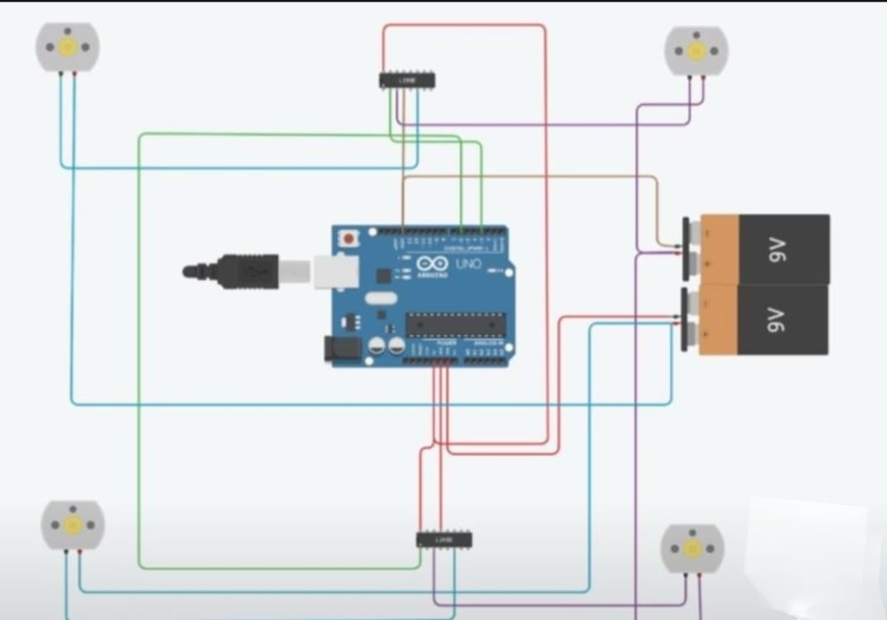

# Voice-Controlled-Car
An Arduino-based voice-controlled robotic car that enables hands-free navigation using Bluetooth. Voice commands from a smartphone are transmitted via an HC-05 module to the Arduino, which controls DC motors through a motor driver for real-time wireless movement and direction control.

## Features
- Voice-controlled navigation
- Bluetooth communication
- Wireless operation
- Real-time motor control

## Components
- Arduino Uno
- HC-05
- L293D Motor Shield
- 4 DC Motors
- Chassis
- Battery Pack

## Project Images

### Prototype 1

### Prototype 2

## Circuit Diagram

## Working Demonstration

Download or watch the demo here: [working_demo.mp4](working_demo.mp4)

## License
MIT
